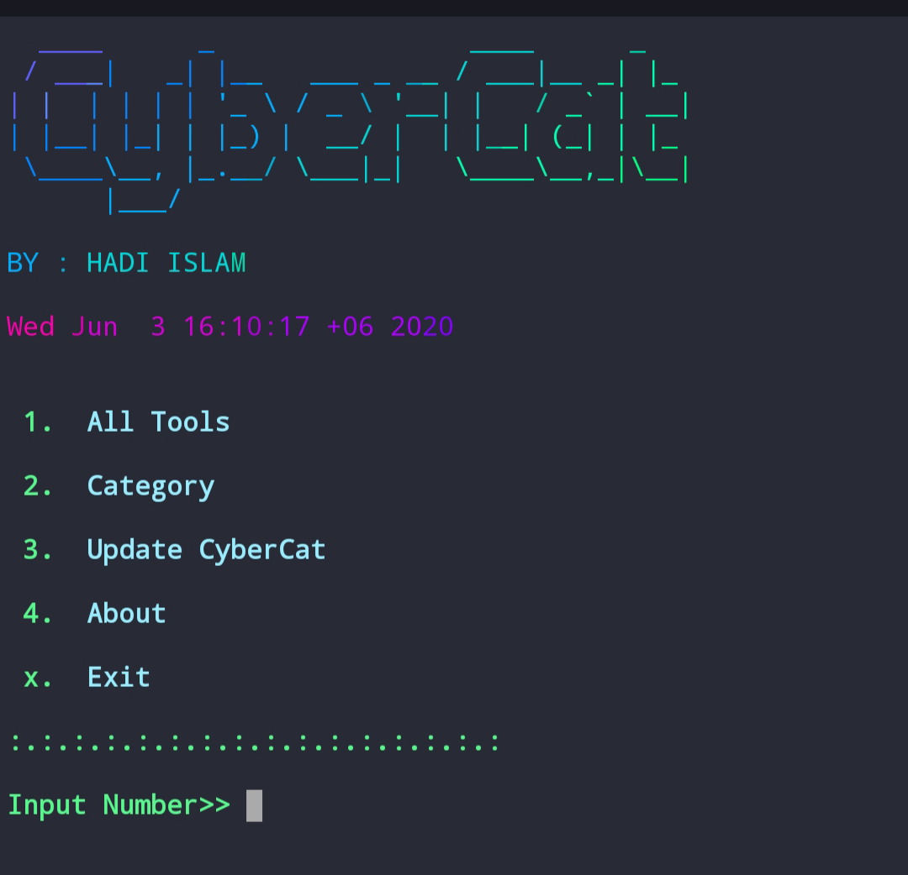

    

      All In One Termux Tools

  
    
  
  
  

 

  
 

 

### Introduction

*CyberCat is a Kali Linux hacking tools installer for Termux .*
CyberCat was developed for Termux. Using CyberCat, you can install powerful hacking tools in Termux.

 

------------------------------------------------------------------------

### Operating System Requirements

• **Android** (Using the Termux App)  

------------------------------------------------------------------------

### How to Install

Open the terminal and type following commands.

* `apt update`

* `apt install git`

* `git clone https://github.com/hadiislam/CyberCat.git`

* `cd CyberCat`

* `chmod +x *`

* `sh cat.sh` if not work than use `./cat.sh`

------------------------------------------------------------------------

### How to Use ?

Enter a Number for a specific output:
- (1) : To show all available tools and type the number of a tool which you want to install.
- (2) : To show tools category.
- (3) : If you want to update CyberCat.
- (4) : If you want to know About Us.
- (x) : To exit the tool.

 

------------------------------------------------------------------------

**Warning**

- Use this tool at your own risk!
- Use It At Your Own Risk.
- No Warranty.
- Use it legal purpose only.
- We are not responsible for your actions.
- Do not do things that are forbidden.
- If you are installing this tool.
- That means you are agree with all terms.
